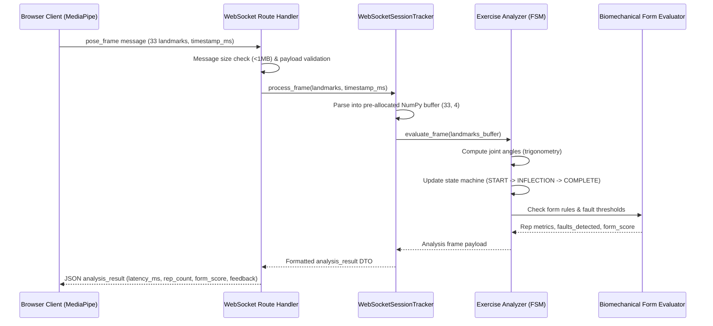

# System Architecture: Real-Time AI Gym Trainer

This document provides a technical explanation of the Real-Time AI Gym Trainer system architecture, detailing subsystem boundaries, data flow pipelines, security controls, and deployment topology.

Visual architectural diagrams for all key workflows are available in [docs/diagrams/](file:///c:/Users/MOD/Desktop/ai-gym-trainer/docs/diagrams/):
- [System Architecture](file:///c:/Users/MOD/Desktop/ai-gym-trainer/docs/diagrams/system-architecture.md)
- [Real-Time Processing Flow](file:///c:/Users/MOD/Desktop/ai-gym-trainer/docs/diagrams/realtime-flow.md)
- [Backend Architecture](file:///c:/Users/MOD/Desktop/ai-gym-trainer/docs/diagrams/backend-architecture.md)
- [Authentication Flow](file:///c:/Users/MOD/Desktop/ai-gym-trainer/docs/diagrams/authentication-flow.md)
- [AI Coach Flow](file:///c:/Users/MOD/Desktop/ai-gym-trainer/docs/diagrams/ai-coach-flow.md)
- [Database Architecture](file:///c:/Users/MOD/Desktop/ai-gym-trainer/docs/diagrams/database-architecture.md)
- [Docker Deployment](file:///c:/Users/MOD/Desktop/ai-gym-trainer/docs/diagrams/docker-deployment.md)

---

## 3.1 High-Level Architecture

The Real-Time AI Gym Trainer operates across a decoupled, client-server hybrid computing model:

```
[ Client Browser: Next.js 15 ]
   │
   ├─► Camera Video Stream (HTMLVideoElement 30 FPS)
   ├─► Client-Side MediaPipe (Extracts 33 3D Keypoints)
   │
   ├── [ HTTP / REST (JWT Bearer) ] ──────────► [ FastAPI Backend ]
   │   (Auth, Workouts, Profile, Analytics, Coach)   │
   │                                                 ├─► [ PostgreSQL Database ]
   │                                                 │   (Workouts, Reps, Profiles)
   └── [ WebSocket (/api/v1/ws/stream?token=JWT) ] ──┤
       (Bi-directional 30 FPS Telemetry Stream)      └─► [ Ollama LLM Service ]
                                                         (Post-Workout Coaching)
```

### Communication Paths
1. **Real-Time Video / Telemetry Path**:
   - The user's browser accesses the local webcam via `navigator.mediaDevices.getUserMedia`.
   - MediaPipe Pose runs inside the client browser, inferring 33 3D normalized body landmarks per frame.
   - Raw video frames **never leave the user's browser**, preserving privacy and eliminating massive network bandwidth requirements.
   - Landmark coordinates are dispatched at ~30 FPS over an authenticated WebSocket (`/api/v1/ws/stream?token=<JWT>`).
   - The FastAPI backend validates frames, passes coordinates through the selected exercise state machine and biomechanical angle calculators, evaluates form faults, and returns an `analysis_result` JSON packet in <15ms.

2. **REST Management & Telemetry Persistence Path**:
   - Standard CRUD operations (user registration, login, workout lifecycle, analytics dashboards, personalization profiles) communicate over standard HTTPS/JSON with JWT Bearer authentication.
   - When an exercise set completes or a workout finishes, aggregated metrics are committed to PostgreSQL in an atomic transaction.

3. **Asynchronous Post-Workout AI Coach Path**:
   - When requested after a workout session, the backend builds an authoritative, fact-checked `CoachContext` from the database.
   - The context is forwarded to a local Ollama LLM instance (default `llama3.2`) with strict system prompt guardrails.
   - If Ollama is unavailable or times out, an offline deterministic rule-based engine generates structured feedback without failing the request.

---

## 3.2 Backend Architecture

The backend follows a 4-tier layered architecture enforcing clean separation of concerns:

```
+-------------------------------------------------------------+
| 1. API Routing Layer (backend/app/api/v1/)                  |
|    - auth.py, workouts.py, analytics.py, profile.py,        |
|      coach.py, exercises.py, health.py, websocket.py        |
+------------------------------+------------------------------+
                               |
+------------------------------v------------------------------+
| 2. Service Layer (backend/app/services/)                    |
|    - AuthService, WorkoutService, PersonalizationService,   |
|      CoachService, WebSocketService, AnalysisService        |
+------------------------------+------------------------------+
                               |
+------------------------------v------------------------------+
| 3. AI / Computer Vision Subsystem (ai/ and backend/app/ai/)  |
|    - ExerciseRegistry & Analyzers (Squat, Pushup, Curl, etc)|
|    - TemporalExerciseInferenceEngine / ExerciseInference    |
|    - Angle calculators, landmark buffers, rule evaluators   |
+------------------------------+------------------------------+
                               |
+------------------------------v------------------------------+
| 4. Repository & Persistence Layer (backend/app/repositories)|
|    - UserRepository, WorkoutRepository, AnalyticsRepository |
|    - SQLAlchemy 2.0 AsyncSession, Alembic Migrations        |
+-------------------------------------------------------------+
```

### Layer Responsibilities
- **API Layer**: Parses HTTP/WS protocols, performs Pydantic request validation, extracts authenticated credentials via dependencies, enforces sliding-window rate limits, and maps domain exceptions to HTTP status codes.
- **Service Layer**: Houses core business workflows, transaction boundaries, state coordination, and security ownership validation.
- **AI/CV Layer**: Stateless mathematical computation, joint angle trigonometry, kinematic state machines, repetition counters, and ML sequence inferencing.
- **Repository / Database Layer**: Pure data access logic, optimized SQL aggregations, composite-index query executions, and database schema migrations.

---

## 3.3 Real-Time Processing Lifecycle

The real-time loop guarantees sub-15ms server turn-around:



### Key Real-Time Constraints:
- **Zero Database Writes Per Frame**: Real-time frames operate 100% in-memory. Database writes only occur at session transition boundaries (`start_session`, `stop_session`, `finish_workout`).
- **Memory Reuse**: Landmark coordinates are ingested directly into pre-allocated NumPy `(33, 4)` float32 arrays to prevent Python garbage collection spikes.
- **Client Frame Throttling**: The Next.js frontend caps webcam inference to ~30 FPS (33.3ms intervals) and utilizes an `isProcessingRef` lock to discard queued frames if the browser thread is busy.

---

## 3.4 Exercise Analysis Architecture

Every supported exercise inherits from `BaseExercise` and implements a deterministic Finite State Machine (FSM):

### State Machine Lifecycle
```
[IDLE / READY] ──(Inflection angle threshold)──► [DESCENDING / CONCENTRIC]
      ▲                                                      │
      │                                                      ▼
[COMPLETED REP] ◄──(Return to extension)────────────── [BOTTOM / PEAK]
```

### Biomechanical Metrics Tracked

| Exercise | Primary Joint Angles | Key Form Faults Detected | Valid Rep Criteria |
|---|---|---|---|
| **Squat** | Hip-Knee-Ankle (Knee), Shoulder-Hip-Knee (Hip) | `KNEE_VALGUS` (caving in), `INSUFFICIENT_DEPTH` (>100° knee), `FORWARD_TRUNK_LEAN` (<45° torso), `ASYMMETRIC_HIP_SHIFT` | Knee angle <= 100°, full extension at top |
| **Push-up** | Shoulder-Elbow-Wrist (Elbow), Shoulder-Hip-Ankle (Spine) | `ELBOW_FLARE` (>75° shoulder angle), `SAGGING_HIPS` (<160° torso), `HIKED_HIPS` (>195° torso), `INSUFFICIENT_DEPTH` | Elbow angle <= 90°, aligned spine |
| **Bicep Curl** | Shoulder-Elbow-Wrist (Elbow) | `ELBOW_SWAY` (elbow drifting forward/back), `TRUNK_SWAY` (momentum swinging), `INCOMPLETE_RANGE_OF_MOTION` | Flexion <= 45°, extension >= 150° |
| **Lunge** | Lead Knee, Trailing Knee, Torso Angle | `FRONT_KNEE_OVER_TOES` (>95° angle), `TORSO_LEAN`, `INSUFFICIENT_DEPTH` (lead thigh not parallel) | Lead knee ~90°, upright torso |
| **Shoulder Press** | Elbow Angle, Lumbar Hyperextension Angle | `ARCHED_BACK` (lumbar extension >15°), `INCOMPLETE_LOCKOUT` (elbows not fully extended), `ASYMMETRICAL_PRESS` | Full overhead extension, neutral spine |

### Form Scoring Formula
Form scoring is deterministic and normalized from 0 to 100:
$$\text{Form Score} = \max\left(0, 100 - \sum \text{Severity Penalties}\right)$$
- Minor fault: 5-point deduction
- Moderate fault: 10-point deduction
- Severe fault: 20-point deduction

---

## 3.5 Machine Learning Architecture

The system incorporates a pluggable AI subsystem (`ai/` and `backend/app/ai/`):

```
                       [ Input Landmark Sequence ]
                                   │
                                   ▼
                   [ BaseAIInferenceService Interface ]
                                   │
        ┌──────────────────────────┴──────────────────────────┐
        ▼                                                     ▼
[ TemporalExerciseInferenceEngine ]               [ ExerciseInferenceEngine ]
- PyTorch 3D CNN / Temporal Conv                  - Scikit-learn Random Forest / MLP
- Window: 30 frames x 33 landmarks                - Handcrafted geometric features
- File: models/temporal_exercise_classifier.pt   - File: models/exercise_classifier.joblib
        │                                                     │
        └──────────────────────────┬──────────────────────────┘
                                   │ (If neither model file exists)
                                   ▼
                     [ Heuristic Fallback Engine ]
                     - Deterministic biomechanical classification
                     - is_stub = True, model_info = "heuristic_fallback_stub"
                     - No fabricated probabilities or false accuracy claims
```

### ML Engineering Safeguards
1. **Inference Optimization**: PyTorch evaluation runs inside `torch.inference_mode()`, preventing autograd tracking and reducing memory allocation overhead.
2. **Batching**: The `predict_batch` method vectors sequences into single `(B, W, F)` tensors to maximize compute efficiency.
3. **Transparent Fallback**: When trained model weights are not loaded on disk, the system explicitly marks responses as heuristic fallbacks, ensuring reproducible tests without requiring multi-gigabyte weight downloads.

---

## 3.6 AI Coach Architecture

The AI Coach delivers personalized post-workout recommendations while preventing hallucinations:

```
[ Workout DB Records ] + [ User Profile & Trends ]
                      │
                      ▼
             [ CoachContext DTO ]
   (Strict, verified facts: reps, form scores, faults)
   (ZERO raw video frames or camera images)
                      │
                      ▼
             [ CoachService ]
                      │
        ┌─────────────┴─────────────┐
        ▼                           ▼
[ OllamaCoachProvider ]   [ DeterministicFallbackCoachProvider ]
- Model: llama3.2 (Local) - Offline rule-based engine
- Strict JSON Schema      - Biomechanical fault lookup
- Timeout: 30s            - Always available, 0ms latency
        │                           │
        └─────────────┬─────────────┘
                      │
                      ▼
        [ CoachStructuredOutput Schema ]
   (summary, strengths, areas_to_improve, next_focus)
                      │
                      ▼
          [ coaching_feedbacks DB Table ]
```

### Fact Protection Principles:
1. **Zero Video Processing by LLM**: The LLM never sees video, pixels, or raw coordinates. It consumes purely structured aggregated metrics calculated deterministically by the CV engine.
2. **Constrained System Prompt**: The system prompt strictly prohibits inventing workout statistics, modifying numerical values, or diagnosing medical conditions.
3. **Structured Pydantic Validation**: All LLM responses are validated against the `CoachStructuredOutput` schema. If parsing fails, the system logs a warning and transparently invokes the deterministic fallback.

---

## 3.7 Authentication & Authorization Architecture

Authentication is stateless and cryptographically verified:

```
[ Client ] ── POST /auth/register ──► Hash with bcrypt (12 rounds) ──► DB (users table)
[ Client ] ── POST /auth/login ──────► Verify hash ─────────────────► Issue JWT (HS256)

[ Client ] ── Header: Bearer <JWT> ──► FastAPI get_current_user Dependency
                                       ├─ Validates Signature & Expiration (iat, exp)
                                       ├─ Loads User Record (checks is_active=True)
                                       └─ Injects Current User into Route Handler
```

### Authorization Rules:
- **Ownership Verification**: All routes operating on user data (`/workouts/{id}`, `/coach/{id}`, `/analytics/`) enforce `Workout.user_id == current_user.id`. Violations return `403 Forbidden` or `404 Not Found`.
- **WebSocket Handshake**: Since browser WebSocket APIs do not support custom request headers, authentication passes the token via query parameter: `ws://host/api/v1/ws/stream?token=<JWT>`. The connection is rejected with close code `1008` (Policy Violation) if the token is missing or invalid.
- **Production Secret Validation**: In production environments (`ENVIRONMENT=production`), the application validates that `JWT_SECRET_KEY` is not set to any known insecure default, refusing to boot if a secure key is missing.

---

## 3.8 Data Architecture

The PostgreSQL schema is structured for transactional integrity and optimized time-series aggregation:

- **`users`**: Primary identity entity (UUID PK, unique email, bcrypt hash).
- **`user_profiles`**: 1:1 user fitness preferences (fitness goal, experience level, preferred focus, coaching style).
- **`workouts`**: Parent session entity (duration, total calories, overall form score, status).
- **`exercise_sessions`**: 1:N sets per workout (exercise name, session order, target/completed/valid/invalid reps, average form score).
- **`exercise_results`**: 1:N repetition records per set (rep number, validity, joint angles, duration, detected faults JSON).
- **`form_issues`**: 1:N fine-grained biomechanical faults per rep (issue code, severity enum, timestamp).
- **`coaching_feedbacks`**: 1:1 post-workout LLM coaching assessment and recovery advice.

Full ER diagram and table schemas are documented in [docs/diagrams/database-architecture.md](file:///c:/Users/MOD/Desktop/ai-gym-trainer/docs/diagrams/database-architecture.md).

---

## 3.9 Deployment Architecture

The application is packaged as a multi-container Docker Compose application:

- **Frontend (`ai_gym_frontend`)**: Next.js 15 standalone server on port 3000, running as unprivileged `nextjs` user.
- **Backend (`ai_gym_backend`)**: FastAPI ASGI server via Uvicorn on port 8000, running as unprivileged `appuser`.
- **Database (`ai_gym_postgres`)**: PostgreSQL 15 Alpine on port 5432, strictly bound to `127.0.0.1` to prevent external network exposure.
- **LLM (`ai_gym_ollama`)**: Ollama server on port 11434, bound to `127.0.0.1`.

Full container networking and security policies are documented in [docs/diagrams/docker-deployment.md](file:///c:/Users/MOD/Desktop/ai-gym-trainer/docs/diagrams/docker-deployment.md).

---

## 3.10 Security Architecture (Phase 19 Hardening)

The system incorporates defensive layers across the network, application, database, and container runtimes:

1. **Sliding-Window Rate Limiting**:
   - `SlidingWindowRateLimiter` enforces in-memory rate limits on sensitive endpoints:
     - Authentication (`/api/v1/auth/*`): 10 requests / minute per client IP.
     - AI Coach (`/api/v1/coach/*`): 10 requests / minute per client IP.
     - WebSocket Connections (`/api/v1/ws/stream`): 30 connection attempts / minute per client IP.
2. **HTTP Security Headers Middleware**:
   - `SecurityHeadersMiddleware` injects modern browser defensive headers on all responses:
     - `X-Content-Type-Options: nosniff`
     - `X-Frame-Options: DENY`
     - `X-XSS-Protection: 1; mode=block`
     - `Referrer-Policy: strict-origin-when-cross-origin`
     - `Content-Security-Policy: default-src 'self'; ...`
3. **Least-Privilege Containerization**:
   - Containers run with `security_opt: ["no-new-privileges:true"]`.
   - Both backend and frontend Dockerfiles define unprivileged system users (`appuser` UID 10001, `nextjs` UID 1001) rather than running as root.
4. **Secret Handling & Audit Cleanliness**:
   - Zero hardcoded production secrets in version control.
   - Bandit SAST scan: 0 security issues across 10,500+ lines of Python code.
   - pip-audit: 0 known vulnerabilities across backend dependencies.
