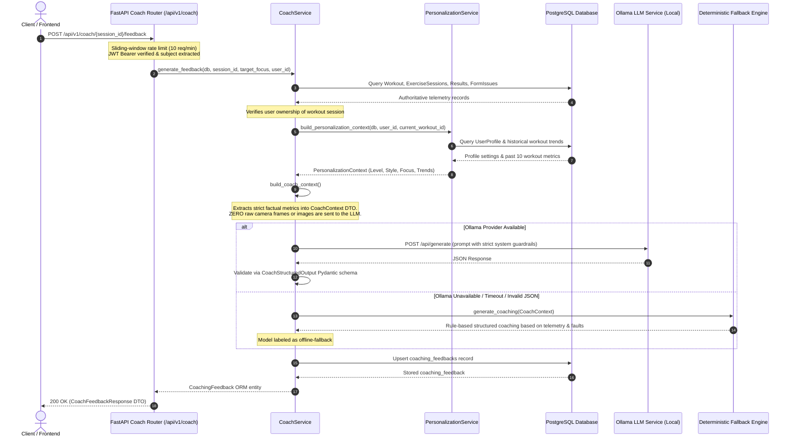

# AI Coach Architecture & Flow

This document details the architecture and execution sequence of the post-workout AI Coach service.

## Architectural Principles

1. **Fact Protection & Grounding**:
   - The LLM does **not** evaluate raw video or camera frames.
   - All input metrics (reps, valid reps, invalid reps, form scores, tempo, biomechanical faults) are calculated deterministically by the computer vision state machines and persisted before coach invocation.
   - The LLM's system prompt restricts it from inventing statistics or altering numerical metrics.

2. **Personalization Integration**:
   - Fitness profile settings (experience level, coaching style, preferred focus) and longitudinal trends across previous sessions are injected into the context without health-diagnosis claims.

3. **Resilience & Fallback**:
   - If Ollama is offline or times out, `DeterministicFallbackCoachProvider` guarantees that the user receives valid, structured advice derived directly from their recorded biomechanical fault codes.
