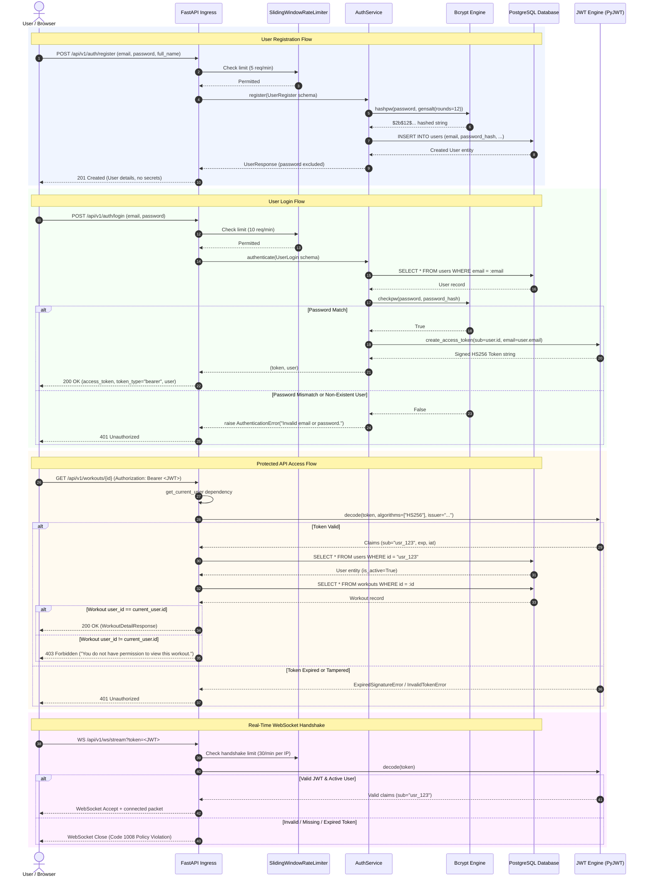

# Authentication & Authorization Flow Diagram

This diagram illustrates user registration, credential verification, JWT token issuance, endpoint protection via FastAPI dependencies, and WebSocket handshake validation.

### Security Guarantees
- **Bcrypt Cost Factor**: 12 rounds ensures resistance to brute-force attacks while remaining efficient for single logins.
- **Algorithm Pinning**: Tokens must match `HS256`; tokens specifying `none` or asymmetric variants are rejected.
- **Multi-Tenant Scoping**: All database queries for user resources explicitly filter by `user_id == current_user.id`.
