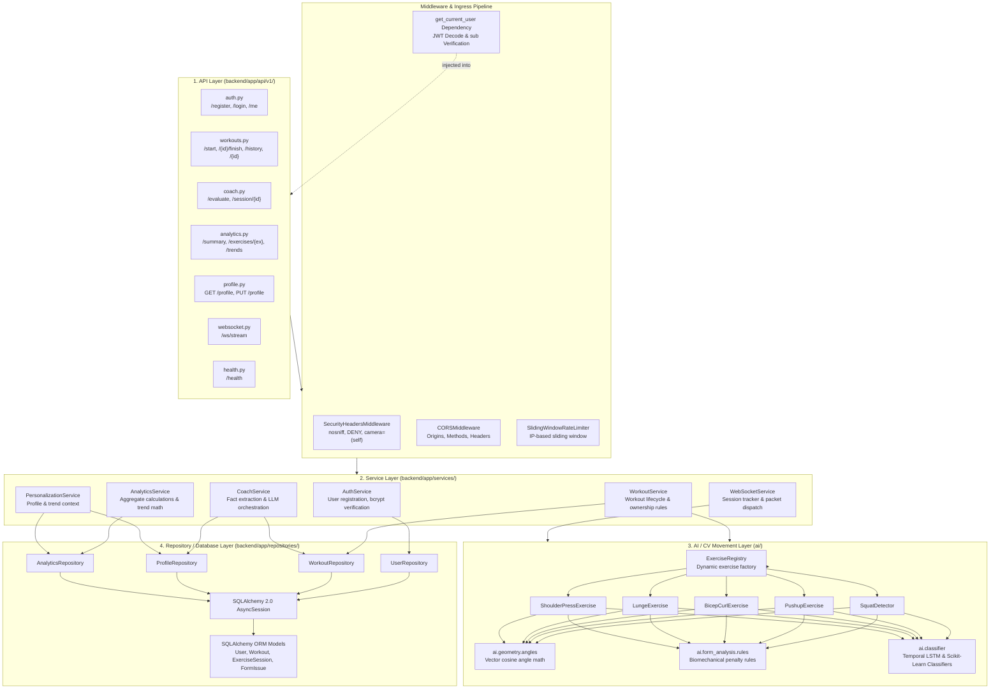

# Backend Architecture Diagram

The FastAPI backend is structured as a strict 4-tier layered architecture (API Layer $\rightarrow$ Service Layer $\rightarrow$ AI/CV Movement Engine $\rightarrow$ Repository / Database Layer) to guarantee separation of concerns, testability, and multi-tenant security.

### Layer Responsibilities
- **API Layer**: Route definitions, HTTP status codes, request/response serialization via Pydantic v2 schemas, and dependency injection (`get_current_user`, `get_db`, `rate_limit`).
- **Service Layer**: Business logic, cross-user authorization enforcement, factual context assembly for the AI Coach, and workout lifecycle orchestration.
- **AI / CV Movement Layer**: Biomechanical angle math, Finite State Machines (FSM) for rep detection, and heuristic form evaluation rules.
- **Repository Layer**: Encapsulates all database queries using SQLAlchemy Core/ORM parameterized expressions with eager loading (`selectinload`).
