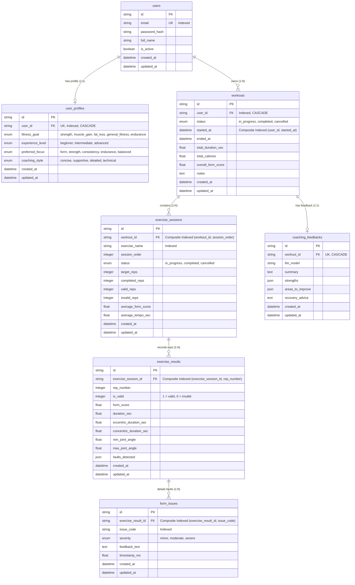

# Database Architecture & Entity Relationships

This document outlines the relational data schema managed via SQLAlchemy (async) and Alembic migrations within the PostgreSQL database.

## Schema Highlights

1. **User Ownership & Cascade Deletion**:
   - `users` owns `user_profiles` and `workouts` via Foreign Keys with `ON DELETE CASCADE`.
   - Deleting a user purges all associated profiles, workouts, exercise sessions, rep results, form issues, and coaching feedbacks.
   - Deleting a workout purges all sets, reps, issues, and AI coach summaries.

2. **Index Optimization**:
   - `ix_workouts_user_started` index on `(user_id, started_at)` optimizes workout history and trend queries.
   - `ix_exercise_sessions_workout_order` on `(workout_id, session_order)` orders sets efficiently.
   - `ix_exercise_results_session_rep` on `(exercise_session_id, rep_number)` orders repetitions.
   - `ix_form_issues_result_code` on `(exercise_result_id, issue_code)` indexes fine-grained faults for fast aggregation.

3. **Data Integrity & Types**:
   - UUIDv4 strings for all primary keys (`id`).
   - SQLite / PostgreSQL dual-dialect support: alembic migrations (`001_initial_schema.py` through `004_security_hardening.py`) maintain schema integrity across testing and production.
