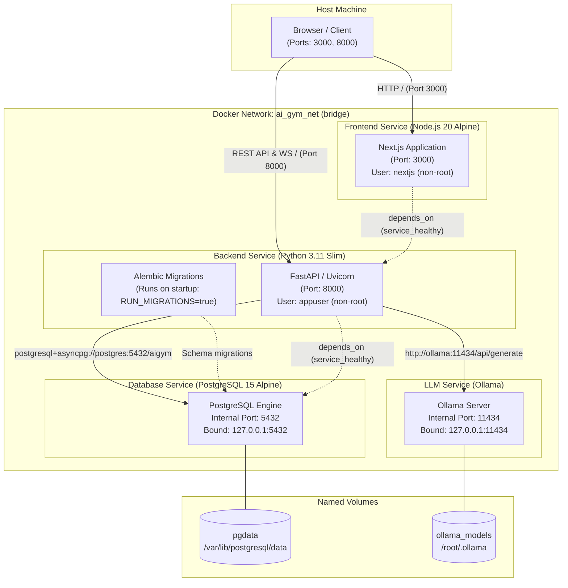

# Docker Deployment Architecture

This document describes the multi-container deployment architecture defined in [docker-compose.yml](file:///c:/Users/MOD/Desktop/ai-gym-trainer/docker-compose.yml).

## Service Configuration & Security Constraints

| Service | Image / Build Context | Exposed Ports | Bound Interface | Non-Root User | Health Check |
|---|---|---|---|---|---|
| `frontend` | `docker/frontend.Dockerfile` | `3000:3000` | `0.0.0.0:3000` | `nextjs` (UID 1001) | `wget --spider http://127.0.0.1:3000/` |
| `backend` | `docker/backend.Dockerfile` | `8000:8000` | `0.0.0.0:8000` | `appuser` (UID 10001) | `curl -f http://localhost:8000/health` |
| `postgres` | `postgres:15-alpine` | `5432` | `127.0.0.1:5432` (loopback only) | `postgres` (system) | `pg_isready -U postgres -d aigym` |
| `ollama` | `ollama/ollama:latest` | `11434` | `127.0.0.1:11434` (loopback only) | Root in container (hardened privileges) | N/A |

### Security Measures in Deployment (Phase 19 Hardening)
1. **Loopback Port Binding**: Internal storage and AI engines (`postgres` and `ollama`) are bound strictly to `127.0.0.1`, preventing external network exposure on public interfaces.
2. **Least Privilege (`no-new-privileges:true`)**: All services run with the Linux `no-new-privileges` flag enabled to prevent setuid privilege escalation.
3. **Dedicated Non-Root Execution**: Both `frontend` (`nextjs`) and `backend` (`appuser`) run as dedicated unprivileged user accounts with restricted filesystem write boundaries.
4. **Health-gated Startup**: Startup dependencies use Docker Compose `service_healthy` conditions: the database must pass readiness checks before the backend boots and runs migrations, and the backend must pass health checks before the frontend begins serving traffic.
