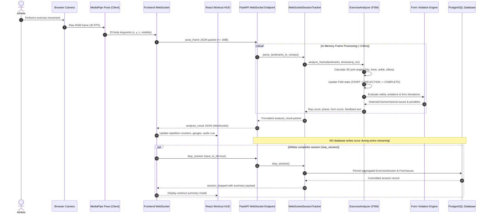

# Real-Time Telemetry Flow Diagram

This diagram documents the sub-10ms per-frame real-time telemetry pipeline, showing how pose frames are generated in the browser, streamed over WebSockets, evaluated in memory, and returned to the athlete's HUD.

### Key Architectural Constraints
1. **Zero Database I/O per Frame**: Frame ingestion and biomechanical evaluation run strictly in memory to sustain 30+ FPS throughput without database lock contention.
2. **Deterministic State Transitions**: State transitions (`UP` -> `DOWN` -> `UP`) require hysteresis thresholds (e.g., knee flexion < 100° for squat descent, > 160° for lockout) to prevent double counting from sensor noise.
3. **Payload Protection**: Messages exceeding 1 MB are dropped with `PAYLOAD_TOO_LARGE` errors to protect the event loop.
