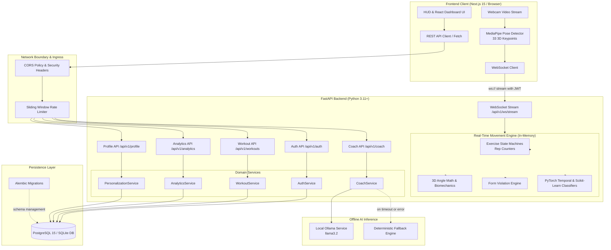

# System Architecture Diagram

This diagram depicts the high-level components and communication pathways across the Real-Time AI Gym Trainer application, separating browser-side telemetry from backend processing, storage, and local LLM inference.

### Component Breakdown
- **Browser Client**: Captures video frames locally using HTML5 `<video>`, extracts 33 body keypoints via MediaPipe Pose, and streams normalized coordinates over WebSocket.
- **FastAPI Layer**: Validates incoming JWT Bearer tokens and applies sliding-window rate limits and security headers (`nosniff`, `DENY`, `camera=(self)`).
- **Real-Time Movement Engine**: Evaluates joint angles, state machine transitions, and safety rule violations in memory at ~30 FPS without database writes per frame.
- **Domain Services & Repositories**: Orchestrates atomic database writes upon workout completion via SQLAlchemy async sessions.
- **Local AI Coach**: Queries authoritative workout telemetry from the database and prompts local Ollama (`llama3.2`) for structured coaching insights with deterministic rule-based fallback.
